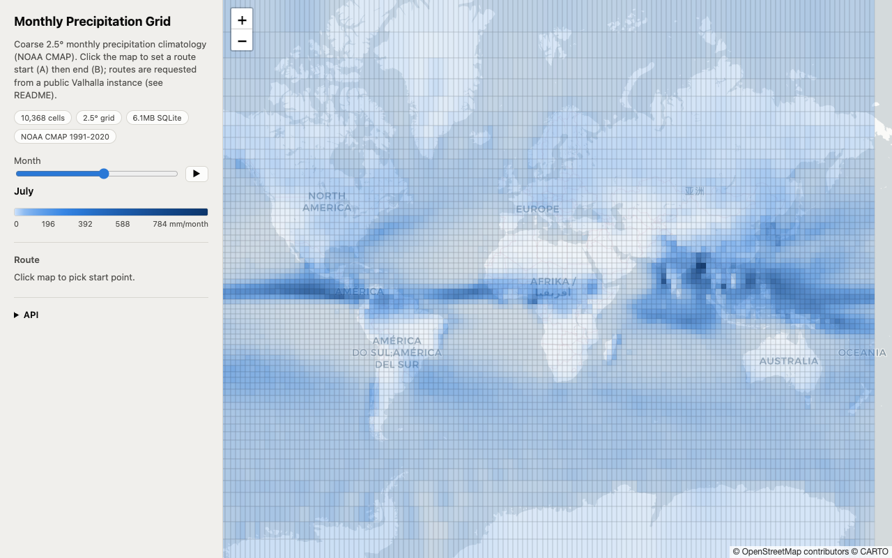
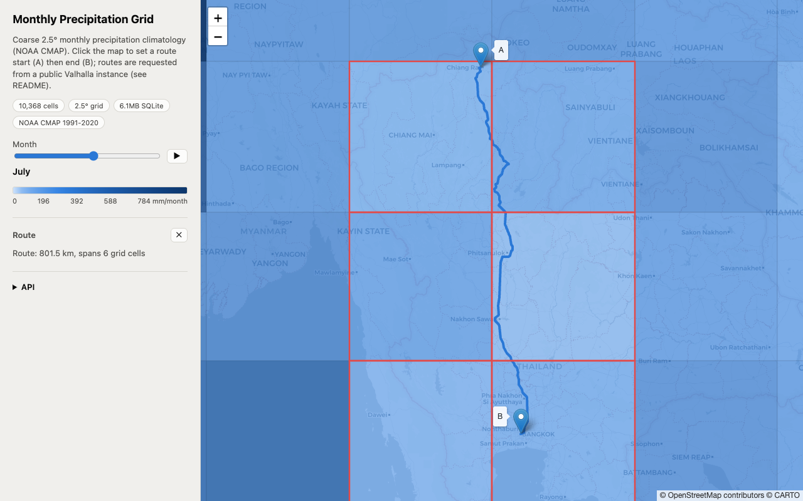

# Monthly Precipitation Grid

A coarse, offline, global monthly precipitation-climatology dataset: a
2.5&deg; grid x 12 calendar months, shipped as a small portable SQLite file,
plus a reference lookup service and a map demo.



> **Status: proof of concept.** This repo demonstrates the dataset, the
> data model, and the API shape a router would want. There's no hosted
> instance and no plan to run one, the `server/` and `public/` demo are
> meant to be cloned and run locally, not deployed as a live service.
> Anyone wanting to actually consume this should follow the "Integration
> guide for routers" below (embed the SQLite file at build time), not
> expect an endpoint to call.

## Dataset at a glance

| | |
|---|---|
| Format | SQLite (2 tables: `cells`, `monthly_precip`) |
| File size | 6.1MB |
| Grid | 2.5&deg; x 2.5&deg;, 72 rows x 144 cols = 10,368 cells |
| Time coverage | 12 calendar months (climatological normals, not a time series) |
| Rows | 124,416 (10,368 cells x 12 months) |
| Baseline period | 1991-2020 |
| Source | NOAA PSL CMAP (public domain) |

## Motivation

This started from a discussion in
[valhalla/valhalla#6183](https://github.com/valhalla/valhalla/issues/6183)
about giving routers a month-aware signal for wet-prone surfaces
(`surface=laterite`, `clay`, `mud`, `ground`/`dirt`). Valhalla's maintainers
agreed the idea was reasonable but that it doesn't belong inside Valhalla
itself, it should be an external, freely-redistributable dataset any routing
engine can plug into, the same way live-traffic providers do.

This repo is that dataset. It's deliberately scoped to just the climatology
data and a generic lookup API, not surface-costing logic. The routing demo
below uses Valhalla purely as one example consumer, calling its public API,
not something bundled into this repo.

## What's in here

- **`scripts/build_grid.py`** builds `data/precip_grid.sqlite` from source
  climate data. Re-run any time to regenerate the database from scratch.
- **`data/precip_grid.sqlite`** the dataset itself: one row per grid cell,
  one row per cell per month (10,368 cells x 12 months). Portable, tiny
  (**6.1MB**), queryable from any language with a SQLite driver, no server
  required. See "Dataset at a glance" below for the full breakdown.
- **`server/`** a minimal Node/Express service that wraps the SQLite file
  with an HTTP API, plus a `/api/route` proxy used only by the demo page.
- **`public/`** a static demo page: a Leaflet map showing the grid, a month
  slider, and click-to-route as a consumer-side example.
- **`docker/`** an optional `docker-compose.yml` for running your own local
  Valhalla instead of the public demo instance (useful for a specific region
  or heavier use).

## Data source and license

Precipitation values come from
[NOAA PSL's CMAP](https://psl.noaa.gov/data/gridded/data.cmap.html) (CPC
Merged Analysis of Precipitation) long-term monthly climatology
(`precip.mon.ltm.nc`), a NOAA public-domain product, currently baselined on
1991-2020. It merges rain-gauge observations, satellite estimates, and
reanalysis model output into a **native 2.5&deg; x 2.5&deg; global grid**
(72 x 144 cells), already the coarse, static shape this project wants, no
resampling needed. NOAA only asks for attribution ("data provided by the
NOAA PSL, Boulder, Colorado, USA, from their website at
https://psl.noaa.gov"), which this README provides.

Two other datasets were considered and rejected for this project specifically:

- **WorldClim**: explicitly disallows redistribution/commercial use without
  permission, incompatible with publishing a derived open dataset.
- **CHELSA**: CC0 (public domain), but distributed at ~1km resolution
  (~350MB per monthly GeoTIFF, ~4GB total), which would need a full download
  and downsampling pipeline for no benefit, since the goal is a coarse grid
  anyway.

### What's in each row

- `precip_mm_month`: total precipitation for that calendar month (the
  climatological daily rate x the number of days in that month, using
  standard non-leap calendar lengths). This is the primary value, and what
  the API and demo map use.
- `precip_mm_day`: CMAP's native unit, the climatological mean daily
  precipitation rate, kept alongside the total in case a rate is more useful
  than a monthly sum for a given consumer.
- `valid_yr_count`: how many years of the 1991-2020 baseline actually had
  valid input data for that cell/month, a confidence signal. Cells with a
  low count (sparse gauge/satellite coverage, often in the same undermapped
  regions the original Valhalla issue was concerned about) should be treated
  as less reliable than cells backed by the full 30 years.

### Related NOAA products not included here (by design)

- `precip.mon.mean.nc`: the actual per-year monthly values (not climatological
  normals), for anyone who wants real historical months instead of averages.
- `precip.pentad.mean.nc`: same climatology at 5-day resolution instead of
  monthly.

Neither serves the "coarse and static" goal any better than the monthly
climatology already does, so they're left as a pointer rather than pulled in.

### Known limitations

- CMAP reports **total precipitation only**, it does not separate rain from
  snow. Gauge inputs do capture snowfall as melted-water equivalent, but the
  satellite inputs (IR, passive microwave) are calibrated for rain and are
  known to be less reliable over snow/ice-covered ground and at high
  latitudes. This matters little for the tropical/subtropical use case that
  motivated this project, but is a real caveat for any snowy-region use.
- 2.5&deg; cells are large (roughly 250-280km on a side depending on
  latitude); local microclimates (mountains, coasts) are averaged out by
  design, this is a coarse seasonal signal, not a weather forecast.

## Quickstart

```bash
# 1. Build the dataset (only needed to regenerate it; the repo ships with a
#    prebuilt data/precip_grid.sqlite)
pip install -r scripts/requirements.txt
python3 scripts/build_grid.py

# 2. Run the lookup service + demo page
cd server
npm install
npm start
# -> http://localhost:3000
```

### Querying the data directly

No server needed, query the SQLite file with any client:

```sql
-- find the cell for a lat/lon, then its August total precipitation
SELECT c.id, m.precip_mm_month, m.precip_mm_day, m.valid_yr_count
FROM cells c
JOIN monthly_precip m ON m.cell_id = c.id
WHERE c.lat_min <= 19.9 AND c.lat_max > 19.9
  AND c.lon_min <= 99.8 AND c.lon_max > 99.8
  AND m.month = 8;
```

Or compute the cell id directly (regular grid, no spatial index needed):

```
row = floor((90 - lat) / 2.5)
col = floor(((lon + 360) % 360) / 2.5)
cell_id = row * 144 + col
```

### HTTP API (`server/server.js`)

- `GET /api/precip?lat=&lon=&month=` -> `{ precip_mm_month, precip_mm_day, valid_yr_count, cell_id, bbox, ... }`
- `GET /api/cells?month=&bbox=minLon,minLat,maxLon,maxLat` -> GeoJSON FeatureCollection
  of grid cells for that month, optionally restricted to a bounding box (omit `bbox` for
  the whole globe)
- `GET /api/route?lat1=&lon1=&lat2=&lon2=&costing=` -> proxies to Valhalla's
  `/route` (public demo instance by default, see below), used only by the demo page

## Integration guide for routers

The question this dataset exists to answer: **how should a router actually
consume this**, given a route can have hundreds of edges and you don't want
hundreds of lookups per route?

**Preferred: bake it into the graph at build time, query nothing at request
time.** The dataset is tiny (6MB) and cell lookup is O(1) arithmetic (see
"compute the cell id directly" above), no spatial index, no network call,
no service to depend on. A router's tile/graph-building stage already walks
every edge once, that's the place to look up each edge's home cell (against
a local copy of `precip_grid.sqlite`, or an even smaller array embedded
directly in code) and write the 12 monthly values, or a precomputed seasonal
penalty, onto the edge as a graph attribute. Routing then costs an edge using
data already sitting on it, the same way it already knows the edge's
`surface` tag: no per-segment lookups, no per-route lookups, nothing to
query, ever. Unlike live traffic, this doesn't need a runtime channel at
all, a monthly climatology is static for weeks, so it only needs to be
refreshed on the router's normal tile-rebuild cadence.

**Fallback: batch by bounding box, once per route, if embedding the file
isn't an option.** Don't query per-segment. A route's shape, however many
edges it has, only spans a handful of 2.5&deg; cells (a Chiang Rai to
Bangkok route, ~700km, spans 6). Request `/api/cells?month=&bbox=` once
with the route's bounding box, match each edge's midpoint to a returned
cell locally with the same O(1) arithmetic, done. One request per route
regardless of route length, not one per segment. Note the bbox is a
rectangle, a diagonal route's bbox can include a corner cell the path
never actually passes through, harmless for costing (you just look up a
cell your edge isn't in) but worth knowing if you're counting cells.



What doesn't make sense: a query per segment (network latency x hundreds of
edges, for data that changes monthly, not per-request), or downloading the
whole 10,368-cell dataset repeatedly per route when a bbox slice returns
the 4-10 cells that actually matter.

### The routing demo

`npm start` points `/api/route` at
[valhalla1.openstreetmap.de](https://valhalla1.openstreetmap.de), a public
Valhalla demo instance run by FOSSGIS/OpenStreetMap Germany, by default. Open
`http://localhost:3000`, click a start point then an end point, and the
route is fetched live and drawn on the map alongside the precipitation grid
for the selected month. No local setup required, and no Valhalla code lives
in this repo, it's just one example of a consumer calling an existing API.

To run your own Valhalla instead (a specific region, or heavier use than a
shared public demo instance should take):

```bash
cd docker
docker compose up   # builds a small Andorra extract by default
VALHALLA_URL=http://localhost:8002 npm start
```

Edit `docker/docker-compose.yml`'s `tile_urls` to point at any
[Geofabrik](https://download.geofabrik.de/) `.osm.pbf` for a different region.

## License

Code in this repository is MIT licensed (see `LICENSE`). The bundled
`data/precip_grid.sqlite` is derived from NOAA public-domain data, see
"Data source and license" above.
